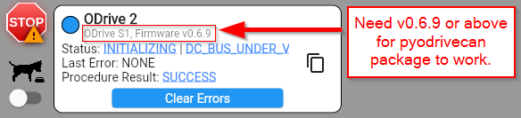
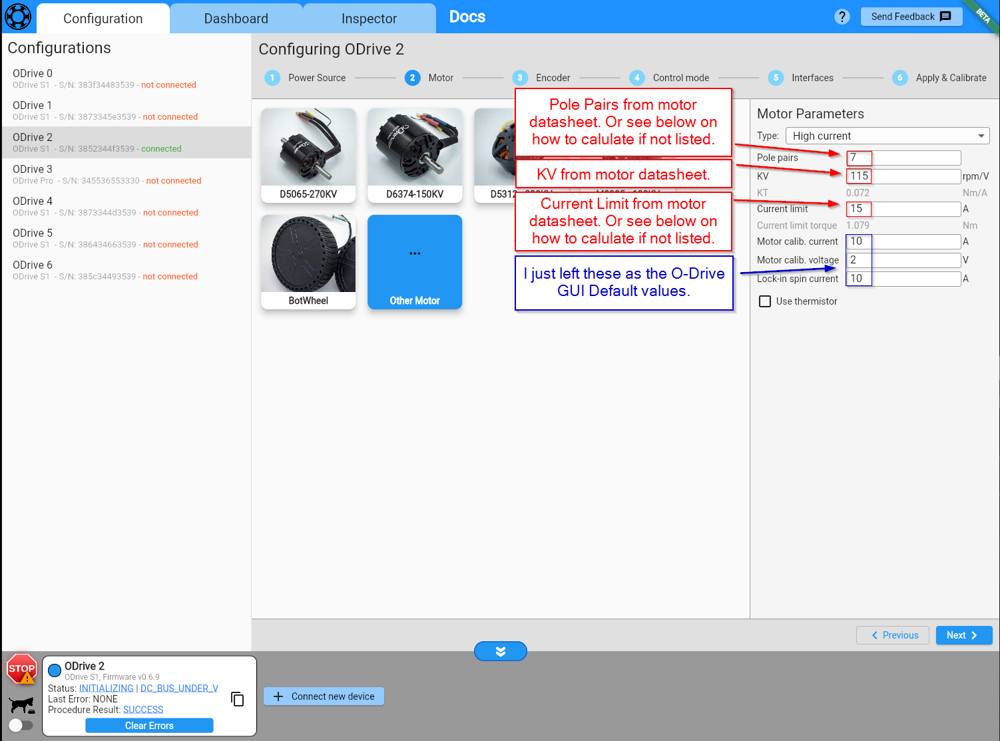
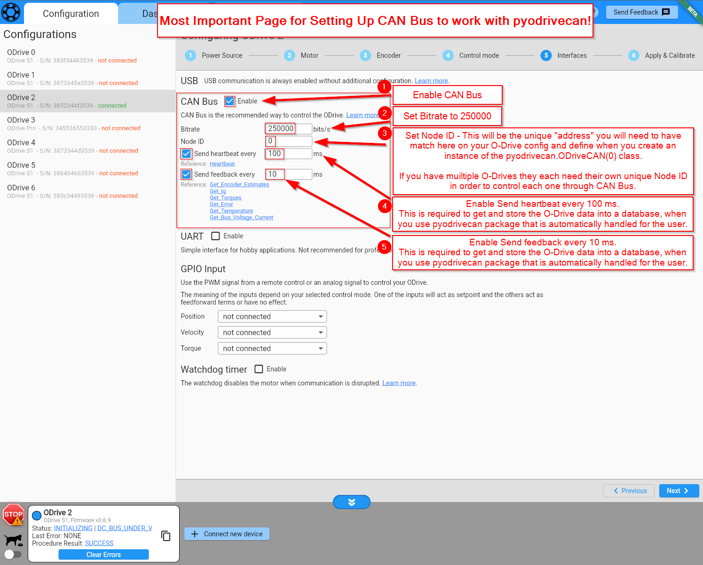
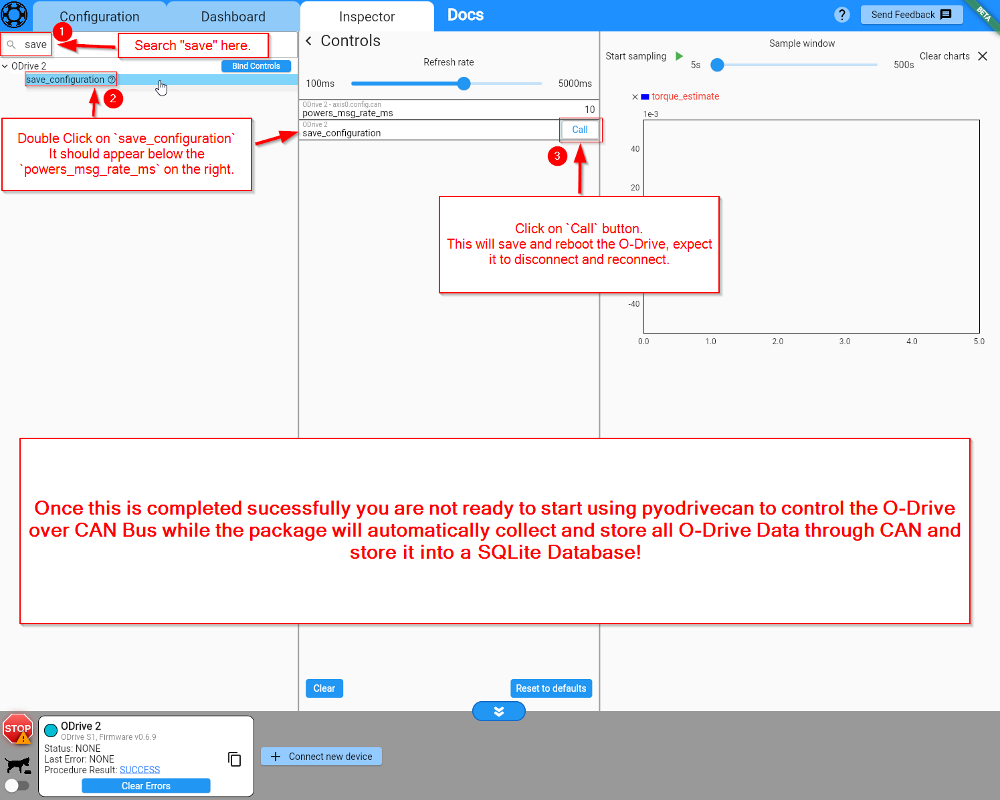

# ODriveCan

!!! Info This is a tutorial page on how to configure your O-Drive S1 or Pro in order to use this package. 
    If this is your first time using your O-Drive, I strongly recommend to see the [O-Drive Documentation](https://docs.odriverobotics.com/v/latest/guides/getting-started.html)  
    and start with their tutorial and using the web GUI to get your motor spinning for the first time.

  
    In this example I will be using a Raspberry Pi 2 Zero W with the WaveShare RS485 CAN HAT.

!!! Tip 
    If you have not already set up your Raspberry Pi with the [WaveShare RS485 CAN HAT](https://www.amazon.com/RS485-CAN-HAT-Long-Distance-Communication/dp/B07VMB1ZKH/ref=sr_1_3?crid=1DIYQ9H0DCFZX&keywords=waveshare+RS485+CAN+HAT&qid=1707694015&s=electronics&sprefix=waveshare+rs485+can+hat+%2Celectronics%2C97&sr=1-3), please visit this page here to see how to do so: [Raspberry Pi CAN Hat Setup](./piCANHatSetup.md)

&nbsp;

## O-Drive GUI Configuration 

!!! warning O-Drive Firmware >= v0.6.9 to use the pyodrivecan package.
     
    You can check your O-Drive Firmware when connected to the GUI on the bottom left corner:
    = v0.6.9" style="width: 60%; margin-left: 0%;">
    

&nbsp;

### 1. Power Source

&nbsp;
### 2. Motor 

&nbsp;
### 3. Encoder 

&nbsp;
### 4. Control mode

&nbsp;
### 5. Interfaces 

&nbsp;
### 6. Apply and Calibrate 

!!! warning
    If you have your O-Drive powered by a power supply/battery and want to plug in the USB, you need to have a USB Isolator, 
    

!!!  success
    

&nbsp;
#### 7. Set `powers_msg_rate_ms` in Inspector Tab

!!!  success
    

#### Congratulations 