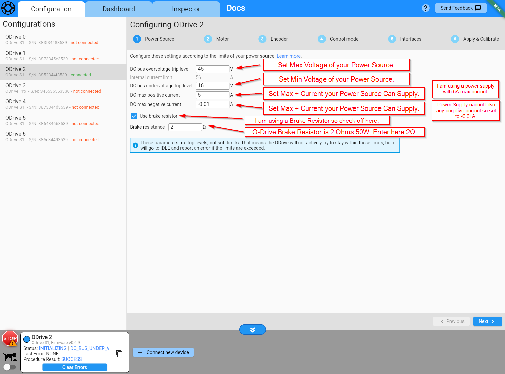
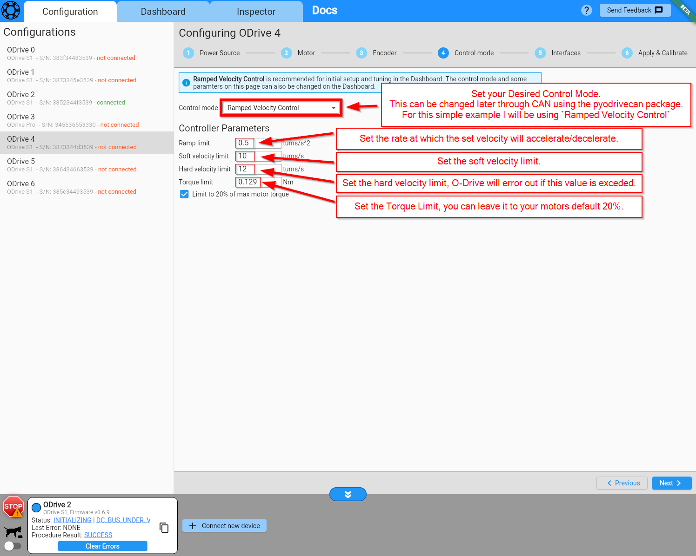
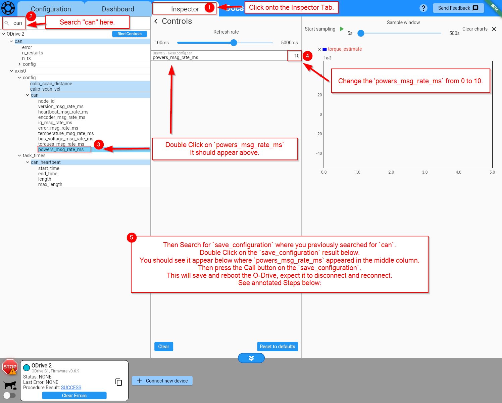

# ODriveCan
This is a tutorial page on how to configure your O-Drive S1 or Pro in order to use this package. 

If this is your first time using your O-Drive, I strongly recommend to see the O-Drive Documentation below 
and start with their tutorial and using the web GUI to get your motor spinning for the first time.

[Here is a link to the official O-Drive Documentation for getting started.](https://docs.odriverobotics.com/v/latest/guides/getting-started.html)

In this example I will be using a Raspberry Pi 2 Zero W with the WaveShare RS485 CAN HAT.
If you have not already set up your Raspberry Pi with the WaveShare RS485 CAN HAT, please visit this page here to see how to do so: 

&nbsp;

## O-Drive GUI Configuration 

!!! warning O-Drive Firmware >= v0.6.9 to use the pyodrivecan package.
     
    You can check your O-Drive Firmware when connected to the GUI on the bottom left corner:
    
    

### 1. Power Source

&nbsp;
### 2. Motor 

&nbsp;
### 3. Encoder 

&nbsp;
### 4. Control mode

&nbsp;
### 5. Interfaces 

&nbsp;
### 6. Apply and Calibrate 

!!! warning
    If you have your O-Drive powered by a power supply/battery and want to plug in the USB, you need to have a USB Isolator, 
    

!!!  success
    

&nbsp;
#### 7. Set `powers_msg_rate_ms` in Inspector Tab

!!!  success
    

