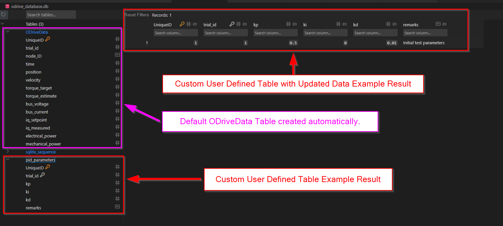

## Tutorial on how to create a custom table and add data to it. 

### Simple Example: 

```python 
import pyodrivecan

database = pyodrivecan.OdriveDatabase('odrive_database.db')

# Define the table name
table_name = "pid_parameters"

# Define columns and SQL datatypes for the new table
columns = [
    ("kp", "REAL"),
    ("ki", "REAL"),
    ("kd", "REAL"),
    ("remarks", "TEXT")
]

# Create the table
database.create_user_defined_table(table_name, columns)

# Define the existing columns, and values for the new record
columns = ["trial_id", "kp", "ki", "kd", "remarks", ]
values = [1, 0.5, 0.00, 0.01, "Initial test parameters"]  # Ensure trial_id 1 exists in ODriveData

# Insert the data from the 'values' list above
database.insert_into_user_defined_table(table_name, columns, values)
```

#### Results:

