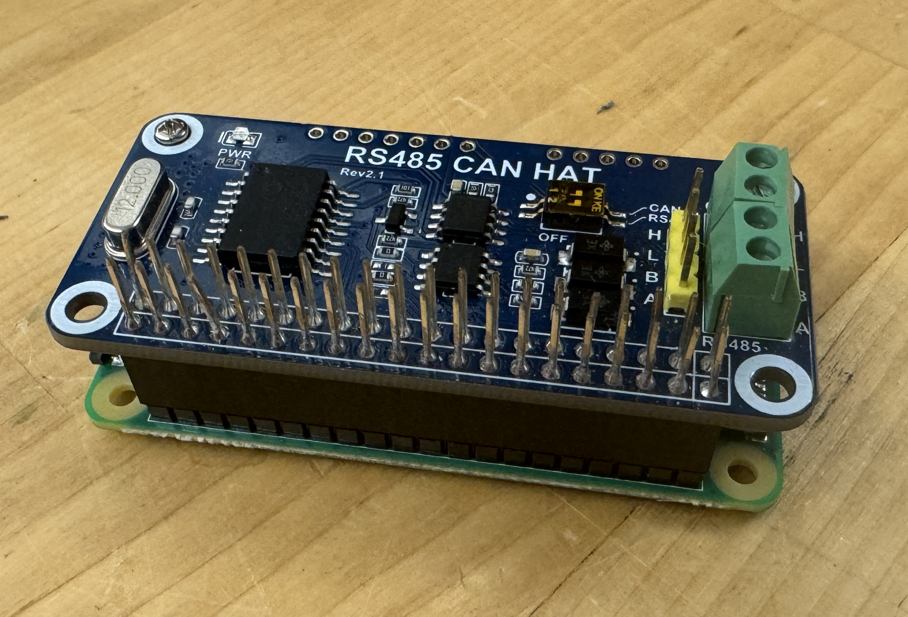
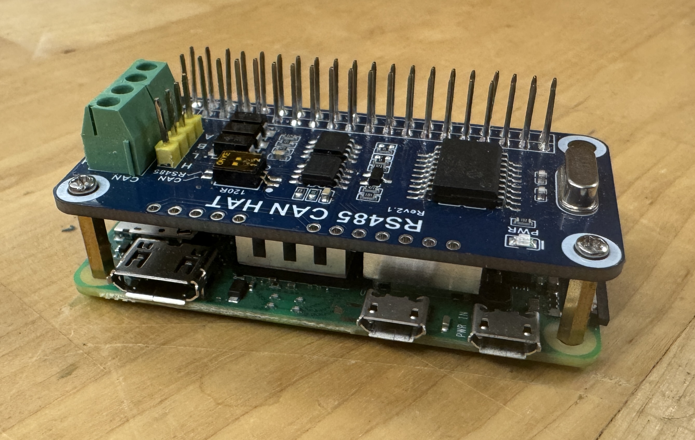

# Raspberry Pi with CAN Hat Setup Page


This page I will go through the components that I am currently using for my examples and how to set them up.
&nbsp;

!!! Note The [WaveShare RS485 CAN HAT](https://www.amazon.com/RS485-CAN-HAT-Long-Distance-Communication/dp/B07VMB1ZKH/ref=sr_1_3?crid=1DIYQ9H0DCFZX&keywords=waveshare+RS485+CAN+HAT&qid=1707694015&s=electronics&sprefix=waveshare+rs485+can+hat+%2Celectronics%2C97&sr=1-3) is required to control an O-Drive S1/Pro using CAN Bus with a Raspberry Pi.
    
    It is compatible with Raspberry Pi 4B/3B+/3B/2B/B+/A+/Zero/Zero W/WH/Zero 2W Series Boards.

    I am using a Raspberry Pi 2 Zero W but you can use any of the Pi models listed above.


***


### 1. Setup CAN Hat 

Once the Raspberry Pi has the Pi OS on it and the CAN Hat should be installed. It should look something like this:
<div>
    
    
</div>
&nbsp;

#### 2. Edit `config.txt` File  
1. Open terminal and edit the config file to allow for the Pi to talk to the CAN Hat:

    ```Bash
    sudo nano /boot/config.txt
    ```

2. Uncomment `#dtparam=spi=on` and  add the following line below it:
    ```bash
    dtparam=spi=on

    dtoverlay=mcp2515-can0,oscillator=12000000,interrupt=25,spimaxfrequency=2000000
    ```
    !!! Example
        

&nbsp;

##### 3. Update Raspberry Pi   

Ensure your Pi is all up to date:
```Bash
sudo apt-get upgrade

sudo apt-get update 
```
&nbsp;

##### 
Once both those have completed we need to reboot the Pi for the edits in the `config.txt` file to work:
```Bash
sudo reboot
```
&nbsp;

#####  After your Pi has restarted you can use the following command to check if the `config.txt` file is correct:
```Bash
dmesg | grep -i '\(can\|spi\)'
```
!!! Success
    

!!! Success
    


&nbsp;
&nbsp;


#### Now we need to install some packages for the CAN Communication to work on the Pi with Python:
```bash
sudo apt-get install can-utils
```
&nbsp;

#### Then we will need to pip install `python-can`:
```bash
pip3 install python-can
```
!!! failure pip3 not found 
    If you get an error and don't have pip run the command `sudo apt-get install python3-pip` to install it.
    Then re-run `pip3 install python-can` command.


&nbsp;
&nbsp;
&nbsp;

!!! success Congratulations you have successfully set up your Pi with its CAN Hat. 
    [**Now move forward to configure your O-Drive for CAN Bus Control with the pyodrivecan package!](./ODriveSetup.md)


&nbsp;
&nbsp;
&nbsp;


!!! info Source O-Drive Docs / WaveShare Wiki
    I would like to thank WaveShare for their documentation and tutorial on how to set this up: [WaveShare CAN Hat Wiki](https://www.waveshare.com/wiki/RS485_CAN_HAT)

    Along with the official O-Drive Documentation also reiterates how to set up the WaveShare RS485 CAN HAT: [Official O-Drive CAN Guide](https://docs.odriverobotics.com/v/latest/guides/can-guide.html)

    You have to scroll down on the O-Drive Documentation Page to "Enable CAN Hat",
    then select the "RS4855 / CAN Hat" tab to see instructions on setup. 