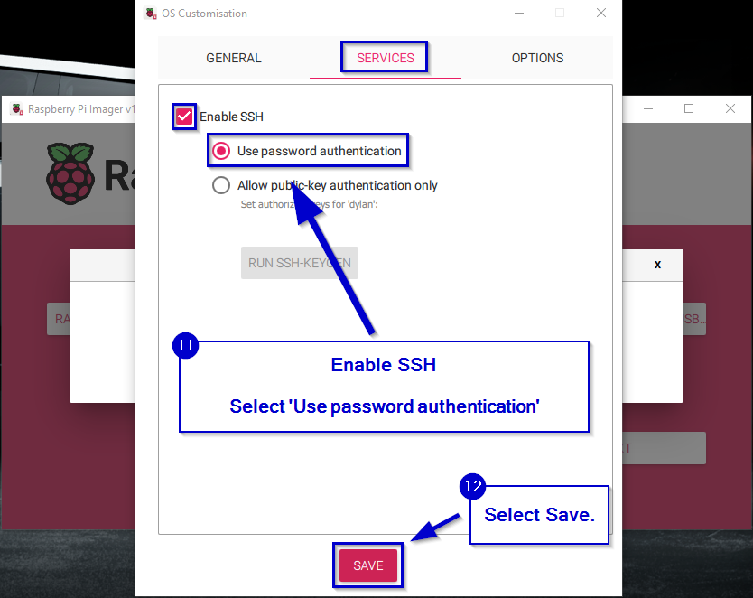

# Raspberry Pi with CAN Hat

This page I will go through the components that I am currently using for my examples and how to set them up.

!!! info 
    The [WaveShare RS485 CAN HAT](https://www.amazon.com/RS485-CAN-HAT-Long-Distance-Communication/dp/B07VMB1ZKH/ref=sr_1_3?crid=1DIYQ9H0DCFZX&keywords=waveshare+RS485+CAN+HAT&qid=1707694015&s=electronics&sprefix=waveshare+rs485+can+hat+%2Celectronics%2C97&sr=1-3) is required to control an O-Drive S1/Pro using CAN Bus with a Raspberry Pi.
    
    It is compatible with Raspberry Pi 4B/3B+/3B/2B/B+/A+/Zero/Zero W/WH/Zero 2W Series Boards. I am using a Raspberry Pi 2 Zero W but you can use any of the Pi models listed above.

## Setup steps:

??? tip "If you have not yet flashed your Pi OS Click Here."
    1. [Install Raspberry Pi Imager](https://www.raspberrypi.com/software/)
    
    2. **Open up Raspberry Pi Imager and Allow it to make changes on your device
    
    3. Select Pi Model, Pi OS, and micro SD Card
    
    4. Select Edit Settings  
    
    5. Enter username, password, Wi-Fi credentials, time zone, keyboard layout.
    
    6. Enable SSH
    
    7. Save and Confirm to write OS
    
    
    8. Confirm successful, remove from computer and plug into Pi
    

??? tip "How to ssh into Pi"
    **Make sure that your pi and device are on the same Wi-Fi network to be able to SSH.**
    1. If you are on windows you need to install a software to be able to SSH. [Install PuTTY if you have not already and are using windows.](https://www.putty.org/)
    
    2. Enter Pi `username@hostname.local` like this `dylan@raspberrypi.local` and select open. 
    
    ??? tip "If the host name doesn't work here is how you can get the IP Address of the Pi."
        A. If you need to find the Pi's IP address you will need to connect to a monitor and enter in this command to its terminal monitor `ifconfig`:
        
        B. Open Putty and type Pi username @ the IP address like this `dylan@192.168.1.17` and select Open:
        
    4.If first time opening Putty you will have to Accept a prompt to connect:
    
    5. Then enter your Pi user's password:
    
    6. Ready to continue to the tutorial below:
    
     


### 1. Setup CAN hat 

Once the Raspberry Pi has the Pi OS on it and the CAN Hat should be installed. It should look something like this:
<div>
    
    
</div>

### 2. Edit `config.txt` file  
Open terminal and edit the config file to allow for the Pi to talk to the CAN Hat:
```Bash
sudo nano /boot/config.txt
```

Uncomment `#dtparam=spi=on` and  add the following line below it:
```bash
dtparam=spi=on

dtoverlay=mcp2515-can0,oscillator=12000000,interrupt=25,spimaxfrequency=2000000
```
!!! example
    

### 3. Update raspberry pi   
Ensure your Pi is all up to date:
```Bash
sudo apt-get upgrade
sudo apt-get update 
```

### 4. Reboot pi 
Once both those have completed we need to reboot the Pi for the edits in the `config.txt` file to work:
```Bash
sudo reboot
```

### 5. Check 
Check if the `config.txt` file is correct/after your Pi has restarted. You can use the following command to check if the `config.txt` file is correct:
```Bash
dmesg | grep -i '\(can\|spi\)'
```
!!! Success
    


### 6. Install CAN dependencies
Now we need to install some packages for the CAN Communication to work on the Pi with Python:
```bash
sudo apt-get install can-utils
```

Then we will need to pip install `python-can`:
```bash
pip3 install python-can
```

Finally, install the `pyodrivecan` package:
```bash
pip3 install pyodrivecan
```

??? failure "pip3 not found"
    If you get an error and don't have pip run the following command to install it.
    ```bash
    sudo apt-get install python3-pip
    ```
    Then re-run pip install python-can command.
    ```bash
    `pip3 install python-can`
    ```
    

??? warning "WARNING: not on PATH"
    If you get this warning after you pip3 install python-can, run this command to fix:
    ```
    echo 'export PATH="$HOME/.local/bin:$PATH"' >> ~/.bashrc && source ~/.bashrc
    ```
    

## Result
!!! success "Congratulations you have successfully set up your Pi with its CAN Hat"

    Now move forward to configure your O-Drive for CAN Bus Control with the pyodrivecan package!

    [Next page](https://dylanballback.github.io/ODriveCan/setup/odrive/setup/)


## Sources

!!! info "Source O-Drive Docs / WaveShare Wiki"
    I would like to thank WaveShare for their documentation and tutorial on how to set this up: [WaveShare CAN Hat Wiki](https://www.waveshare.com/wiki/RS485_CAN_HAT)

    Along with the official O-Drive Documentation also reiterates how to set up the WaveShare RS485 CAN HAT: [Official O-Drive CAN Guide](https://docs.odriverobotics.com/v/latest/guides/can-guide.html)

    You have to scroll down on the O-Drive Documentation Page to "Enable CAN Hat",
    then select the "RS4855 / CAN Hat" tab to see instructions on setup. 